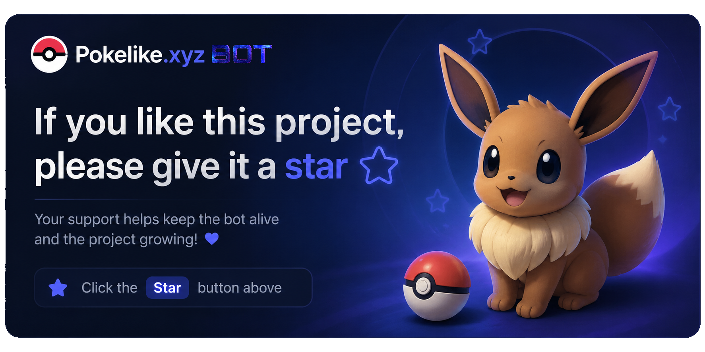
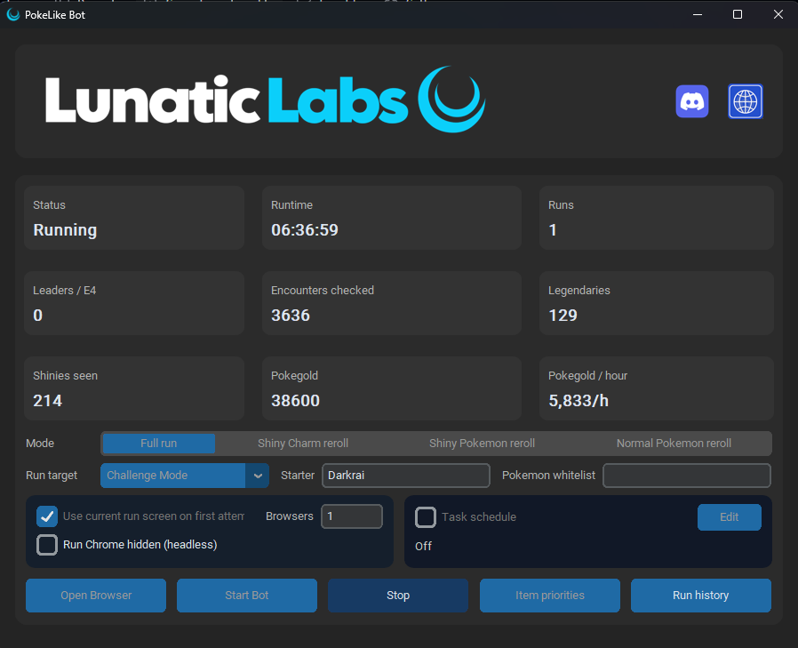
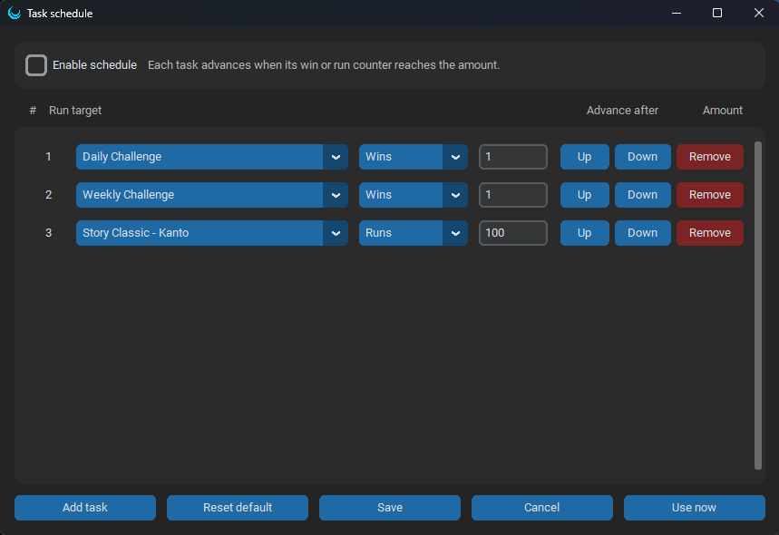

<p align="center">
  
</p>

<h1 align="center">PokeLike Bot</h1>

<p align="center">
  <a href="https://github.com/BIaze420/PokeLike-Bot/releases/latest">
    
  </a>
  <a href="https://github.com/BIaze420/PokeLike-Bot/stargazers">
    
  </a>
  <a href="https://github.com/BIaze420/PokeLike-Bot/subscription">
    
  </a>
</p>

PokeLike Bot is a free Windows automation tool for [PokeLike](https://pokelike.xyz/). It opens one or more Chrome browser windows, starts configured PokeLike runs, and automates common reroll and full-run decisions from a desktop GUI.

If this bot helps you, please give the GitHub repository a star and watch it for updates. It supports the project and helps the maintainer's GitHub account grow.

## Download

For normal users, the packaged `.exe` is the easiest option:

<p>
  <a href="https://github.com/BIaze420/PokeLike-Bot/releases/latest">
    
  </a>
</p>

From the latest release, download:

- `PokeLike Bot.exe`

## Quick Start

1. Download the latest `.exe` from the Releases page.
2. Open PokeLike Bot.
3. Click `Open Browser` and log in to PokeLike inside the bot-controlled browser.
4. Choose a mode, starter, run target, and browser count.
5. Click `Start Bot`.



## Why Use It?

- Automates full runs, shiny rerolls, Pokemon whitelist rerolls, and item choices.
- Supports Story, Battle Tower, Challenge, Weekly, and Daily targets.
- Includes a task schedule for chaining daily, weekly, and repeated achievement runs.
- Tracks run stats including leaders / Elite Four progress, encounters, legendaries, shinies seen, Pokegold, and Pokegold per hour.
- Saves run history with duration, earned Pokegold, score, passives, and team snapshots.
- Can open and tile multiple Chrome windows for faster parallel sessions.
- Uses editable priority lists for items, Pokemon choices, and reward handling.

## Features

- **Graphical control panel** with run status, runtime, run count, leaders / Elite Four progress, encounters checked, legendaries, shinies seen, Pokegold, and Pokegold per hour.
- **Multiple run modes**:
  - Full run
  - Item reroll
  - Shiny Pokemon reroll
  - Normal Pokemon reroll
- **Run target selection** for Challenge Mode, Weekly Challenge, Daily Challenge, Battle Tower regions, and Story regions.
- **Task schedule** for running a sequence of goals, such as Daily Challenge until one win, Weekly Challenge until one win, then Kanto Classic 100 times for achievements.
- **Run history** for the last runs, including runtime, earned Pokegold, score, team snapshot, passive items, legendary encounters, and progress stats.
- **Starter selection** with a configurable starter field.
- **Pokemon whitelist** used by Pokemon reroll modes and full-run catch priority.
- **Multi-browser support** with configurable browser count.
- **Parallel browser launch** so several Chrome windows can open faster.
- **One-load browser startup**: each browser opens PokeLike once, then the app tiles the windows.
- **Window tiling** for multi-browser sessions.
- **Optional manual-start flow** that can use the current run screen on the first attempt.
- **Item priority editor** for starting/passive items and regular reward items.
- **Full-run item automation** with separate starting/passive item priority and regular reward priority.
- **Starting-item ignore list** for items that should never be picked at the passive/starting item screen.
- **Passive item effect display** with built-in known item effects plus local learning for newly discovered item text.
- **Unknown starting item tracking** to help improve the item priority list over time.
- **Catch priority logic** for full runs:
  - Prioritizes shiny Pokemon.
  - Prioritizes legendary Pokemon.
  - Prioritizes Pokemon from the whitelist.
  - Prioritizes dragon and bug choices before random fallback.
  - Uses catch rerolls only after checking the currently visible Pokemon choices.
- **Shiny encounter counting in full-run mode** using visible catch choices encountered during the run.
- **Rare Candy automation** that clicks the Rare Candy badge and uses it on the first Pokemon when available.
- **Move tutor / TM handling** with a quota for the main Pokemon in full-run mode.
- **Team replacement policy** for shiny, legendary, and priority Pokemon rewards.
- **End-screen handling** for Play Again / retry flows.
- **Startup update check** in the packaged `.exe` that downloads and restarts into a newer GitHub release when one is available.
- **Live money tracking** with Pokegold per hour.
- **Branded Lunatic Labs header** with bundled logo assets and Windows icon.

## Task Schedule

The task schedule lets full-run mode chain several goals without manually changing the run target after each run.

Each row has a run target, an advance condition (`Wins` or `Runs`), and an amount. For example, the bot can finish one Daily Challenge win, then one Weekly Challenge win, then continue Story Classic - Kanto for achievement farming.



When the schedule is enabled, the bot uses one browser, advances tasks in order, and stops after the final task is complete.

## Pokemon And Item Logic

PokeLike Bot is built around conservative priority rules so it checks the visible game state before rerolling or skipping rewards.

### Pokemon Priority

- Shiny Pokemon are always prioritized when they appear.
- Legendary Pokemon are prioritized in full-run reward and catch decisions.
- Pokemon listed in the whitelist are treated as priority catches.
- Dragon and bug Pokemon are preferred before random fallback choices in full-run catch screens.
- Catch rerolls are only used after the bot has inspected the visible Pokemon choices first.
- Full-run mode counts shiny encounters from visible catch choices, so the `Shinies seen` stat also works outside dedicated shiny reroll modes.
- Team replacement logic favors keeping shiny, legendary, and priority Pokemon instead of replacing them with weaker choices.

### Move Tutor And TM Logic

- Move Tutor and TM opportunities are prioritized for the main Pokemon.
- Full-run mode uses Move Tutor / TM upgrades until the configured maximum move-upgrade quota is reached.
- After the main Pokemon reaches that quota, the bot stops over-prioritizing move upgrades and continues normal routing/reward logic.

### Starting / Passive Item Logic

Starting and passive items use their own priority list, separate from normal reward items. The default priority includes:

- Shiny Hunter
- Eject Pack
- Soft Sand
- Shiny Power
- Stardust
- Yache Berry
- Grassy Seed
- Dragon Scale
- Light Clay
- Power Bracer
- Macho Brace
- Black Belt
- Wise Glasses

The bot also has a starting/passive never-pick list and records unknown starting items locally so priority rules can be improved over time. Known passive items include built-in effect text in the priority editor, and newly discovered effect text is still learned locally.

### Regular Reward Item Logic

Regular item rewards use a separate priority list. The default priority includes:

- Lucky Egg
- Leftovers
- Shell Bell
- Dragon Fang
- Rare Candy
- TM

Rare Candy is handled through the item bar when available and is used on the first Pokemon.

## Requirements

For source runs:

- Windows 10 or newer
- Python 3.11 recommended
- Google Chrome
- Internet access on first run so webdriver-manager can download the matching ChromeDriver

For normal users, use the packaged `.exe` from the download section above.

## First Run Login

PokeLike Bot uses its own Selenium Chrome profile. It does not use or ship your normal Chrome cookies.

The first time you run the bot:

1. Open PokeLike Bot.
2. Click `Open Browser`.
3. Log in to PokeLike inside the browser window opened by the bot.
4. Complete any cookie/consent prompts if they appear.
5. After you are logged in, choose your mode/settings in the bot and click `Start Bot`.

The packaged app stores its own login/session data locally under:

```text
%LOCALAPPDATA%\PokeLike Bot\selenium-profile
```

That folder is created on the user's computer after running the app. It is not included in this repository or in the release source code.

## Running From Source

```powershell
py -m venv .venv
.\.venv\Scripts\python.exe -m pip install --upgrade pip
.\.venv\Scripts\python.exe -m pip install -r requirements.txt
.\.venv\Scripts\python.exe main.py
```

## Building The EXE

From PowerShell:

```powershell
.\build_exe.ps1
```

The executable will be created at:

```text
dist\PokeLike Bot.exe
```

## Data Storage

When running from source, settings are stored next to `main.py`.

When running as a packaged `.exe`, user data is stored under:

```text
%LOCALAPPDATA%\PokeLike Bot
```

That folder contains user settings, the Selenium Chrome profile, and unknown starting item tracking.

## GitHub Release Build

This repository includes a GitHub Actions workflow:

```text
.github/workflows/build-windows.yml
```

It builds the Windows executable when:

- You manually run the workflow.
- You push a version tag like `v1.0.2`.

## Disclaimer

This is an unofficial community automation tool for PokeLike. Use it responsibly and at your own risk. PokeLike Bot is not affiliated with PokeLike.
